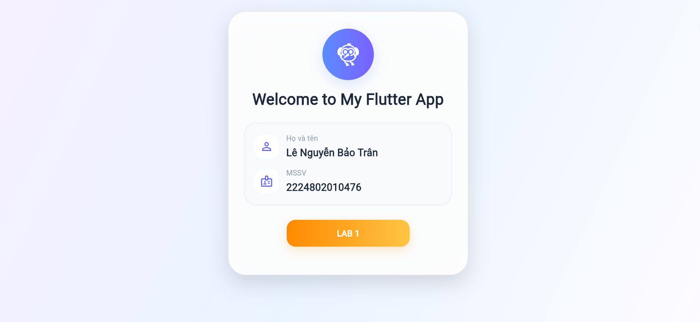

# 🎨 LAB 1 Flutter

## 📌 Giới thiệu
Đây là bài thực hành **LAB 1 môn Flutter** với mục tiêu cài đặt môi trường, tạo ứng dụng Flutter đầu tiên và chỉnh sửa giao diện mặc định thành một màn hình chào mừng đẹp hơn.

Trong bài này, ứng dụng được thiết kế theo phong cách **Welcome Screen / Profile Card**, hiển thị:
- Tiêu đề chào mừng
- Họ và tên sinh viên
-  MSSV
- Giao diện bo góc hiện đại với nền gradient
- Hiệu ứng hover cho nút **LAB 1** khi chạy trên Flutter Web

## 🎯 Mục tiêu bài làm
- Làm quen với cấu trúc project Flutter
- Hiểu cách hoạt động của `MaterialApp`, `Scaffold`, `Container`, `Column`, `Row`, `Wrap`
-  Biết cách thiết kế UI cơ bản bằng Flutter
- Biết tách widget và chỉnh sửa giao diện theo yêu cầu cá nhân
-  Biết thêm hiệu ứng tương tác chuột trên Flutter Web bằng `MouseRegion` và `AnimatedContainer`

## 🛠 Công nghệ sử dụng
-  **Flutter**
-  **Dart**
-  **Visual Studio Code**
-  **Flutter Web** để chạy và xem giao diện trên trình duyệt

## 🖼 Giao diện đã thực hiện


Ứng dụng hiện tại gồm các thành phần chính:
1.  **Nền gradient** cho toàn màn hình
2. **Khung card lớn ở giữa** để chứa toàn bộ nội dung
3.  **Biểu tượng Flutter** trong avatar hình tròn
4. **Tiêu đề Welcome to My Flutter App**
5. 📋 **Khung thông tin cá nhân** gồm:
   - 👤 Họ và tên: **Lê Nguyễn Bảo Trân**
   - 🆔 MSSV: **2224802010476**
6. **Nút chức năng**:
   - `LAB 1`
7. **Hiệu ứng hover**:
   - Khi rê chuột vào nút `LAB 1`, màu sẽ đổi từ xanh/tím sang cam/vàng

## 📂 Cấu trúc file chính
```text
lib/
├── main.dart      
└── tile.dart     
```

## ▶️ Cách chạy project

### 1. Cài dependencies
```bash
flutter pub get
```

### 2. Chạy ứng dụng
```bash
flutter run
```

### 3. Nếu chạy trên web
```bash
flutter run -d chrome
```

## 📚 Nội dung đã học được
Qua bài này, em đã thực hiện được:
- Tạo project Flutter đầu tiên
- Chạy project bằng VS Code
- Chỉnh sửa giao diện mặc định của Flutter
- Tạo bố cục UI bằng các widget cơ bản
-  Tùy chỉnh màu sắc, bo góc, bóng đổ
-  Xử lý lỗi tràn giao diện bằng `SingleChildScrollView`
- 🖱 Thêm hiệu ứng hover cho nút trong Flutter Web

## 🌟 Điểm nổi bật của bài làm
- Giao diện không còn là app counter mặc định
- Có tính cá nhân hóa bằng tên và MSSV
- Có thiết kế hiện đại, dễ nhìn, phù hợp để nộp bài LAB
- Có tương tác hover giúp ứng dụng sinh động hơn

## 👩‍💻 Tác giả
- **Họ và tên:** Lê Nguyễn Bảo Trân
- **MSSV:** 2224802010476
