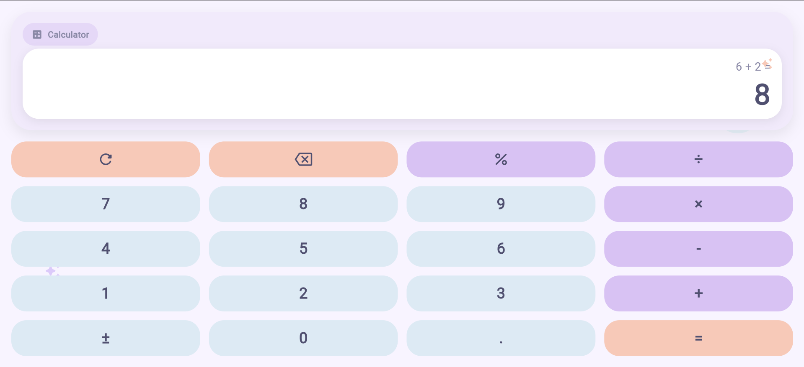

# 🌸 Ứng dụng Máy Tính Pastel

<div align="center">


### ✨ LAB 02 - Máy tính đơn giản bằng Flutter ✨

Ứng dụng máy tính được xây dựng bằng **Flutter** cho bài **LAB 02**.  
Giao diện được thiết kế theo phong cách **pastel nhẹ nhàng**, bo góc mềm mại, có thêm icon và sticker trang trí để ứng dụng trông đẹp mắt hơn nhưng vẫn đảm bảo đầy đủ chức năng tính toán cơ bản.

</div>

---

## 📌 Giới thiệu dự án

Đây là bài thực hành **LAB 02 - Simple Mobile Calculator**.  
Mục tiêu của bài là xây dựng một ứng dụng máy tính đơn giản bằng Flutter, có giao diện đẹp, dễ sử dụng và hỗ trợ các phép tính cơ bản.

Trong bài này, ứng dụng được thiết kế lại theo phong cách **pastel hiện đại**, với:
- giao diện sáng, nhẹ nhàng
- các nút bo tròn
- bảng màu hài hòa
- phần hiển thị kết quả rõ ràng
- icon và sticker nhỏ để giao diện sinh động hơn

---

## 🎯 Mục tiêu bài làm

- Làm quen với cách xây dựng giao diện bằng Flutter
- Hiểu cách dùng `StatefulWidget` để quản lý trạng thái
- Thực hiện các phép toán cơ bản trong ứng dụng
- Xử lý các trường hợp lỗi trong máy tính
- Tạo một giao diện đẹp hơn so với mẫu cơ bản
- Chuẩn bị project hoàn chỉnh để đưa lên GitHub và nộp bài

---

## 🧩 Chức năng chính

### ✅ Các phép toán hỗ trợ
- Cộng `+`
- Trừ `-`
- Nhân `×`
- Chia `÷`
- Dấu thập phân `.`
- Phần trăm `%`
- Đổi dấu `±`
- Xóa toàn bộ `C`
- Xóa ký tự cuối `CE`
- Tính kết quả `=`

### ✅ Chức năng giao diện
- Giao diện màu pastel
- Nút bấm bo góc hiện đại
- Có icon máy tính ở phần tiêu đề
- Có sticker/icon trang trí nhẹ ở nền và khu vực hiển thị
- Bố cục rõ ràng giữa phần hiển thị và phần bàn phím


---

## 🎨 Phong cách thiết kế

Ứng dụng sử dụng phong cách **pastel mềm mại** với bảng màu chính như sau:



- **Nền tổng thể:** tím nhạt pastel
- **Khung chính:** tím kem nhẹ
- **Màn hình hiển thị:** trắng sạch
- **Nút số:** xanh pastel
- **Nút phép toán:** tím pastel
- **Nút hành động:** cam pastel

Ngoài ra, giao diện còn có:
- icon `calculate` ở phần tiêu đề
- icon lấp lánh nhỏ trong vùng hiển thị
- sticker tròn mờ và icon trang trí ở nền
- bóng đổ nhẹ để giao diện có chiều sâu hơn

---

## 🗂 Cấu trúc project

```text
calculator_app/
├── lib/
│   └── main.dart
├── web/
├── android/
├── ios/
├── linux/
├── macos/
├── windows/
├── test/
├── img/
├── pubspec.yaml
└── README.md
```

---

## 🛠 Công nghệ sử dụng

- 💙 **Flutter**
- 🎯 **Dart**
- 💻 **Visual Studio Code**
- 🌐 **Flutter Web** để chạy thử và kiểm tra giao diện

---

## ▶️ Cách chạy project

### 1. Cài dependencies
```bash
flutter pub get
```

### 2. Chạy ứng dụng
```bash
flutter run
```

### 3. Nếu muốn chạy trên Chrome
```bash
flutter run -d chrome
```

---

## 🧠 Tóm tắt logic xử lý

Ứng dụng sử dụng `StatefulWidget` để quản lý trạng thái của máy tính.

### Các biến chính
- `display`: giá trị hiện tại đang hiển thị
- `equation`: biểu thức đang tính
- `num1`: toán hạng thứ nhất
- `num2`: toán hạng thứ hai
- `operation`: phép toán hiện tại
- `shouldResetDisplay`: cờ để reset màn hình khi nhập số mới

### Các hàm chính
- `appendNumber()`: thêm số vào màn hình
- `setOperation()`: lưu phép toán
- `calculateResult()`: tính kết quả
- `clearAll()`: xóa toàn bộ
- `clearEntry()`: xóa ký tự cuối
- `toggleSign()`: đổi dấu số
- `calculatePercent()`: tính phần trăm
- `addDecimal()`: thêm dấu chấm thập phân

---

## 🧪 Các trường hợp đã kiểm tra

Ứng dụng được thiết kế để xử lý các trường hợp như:

- `5 + 3 = 8`
- `3.5 × 2 = 7`
- `-5 + 3 = -2`
- Chia cho 0
- Xóa toàn bộ bằng `C`
- Xóa ký tự cuối bằng `CE`
- Tính phần trăm
- Nhập số thập phân hợp lệ

---

## 📷 Hình ảnh minh họa

Bạn nên tạo thư mục `screenshots/` và chèn ảnh giao diện vào đó.

Ví dụ:

```text
screenshots/
├── home.png
├── calculation.png
└── result.png
```
## 🌟 Điểm nổi bật của bài làm

- Đã thay hoàn toàn giao diện Flutter mặc định
- Ứng dụng vừa có chức năng tính toán vừa có giao diện được chăm chút
- Thiết kế pastel tạo cảm giác nhẹ nhàng, dễ nhìn
- Có icon và sticker nhỏ giúp giao diện sinh động hơn
- Bố cục rõ ràng, phù hợp để nộp bài LAB và đưa lên GitHub

---

## 📚 Những gì em học được

Qua bài LAB này, em đã học được:

- Cách tạo và tổ chức một project Flutter
- Cách xây dựng UI bằng các widget cơ bản
- Cách quản lý trạng thái trong ứng dụng tương tác
- Cách xử lý logic của một máy tính đơn giản
- Cách xử lý các trường hợp lỗi trong ứng dụng
- Cách cải thiện giao diện bằng màu sắc, icon và bố cục đẹp hơn
- Cách chuẩn bị một project hoàn chỉnh để nộp bài

---

## 👩‍💻 Thông tin sinh viên

- **Họ và tên:** Lê Nguyễn Bảo Trân
- **MSSV:** 2224802010476

---


