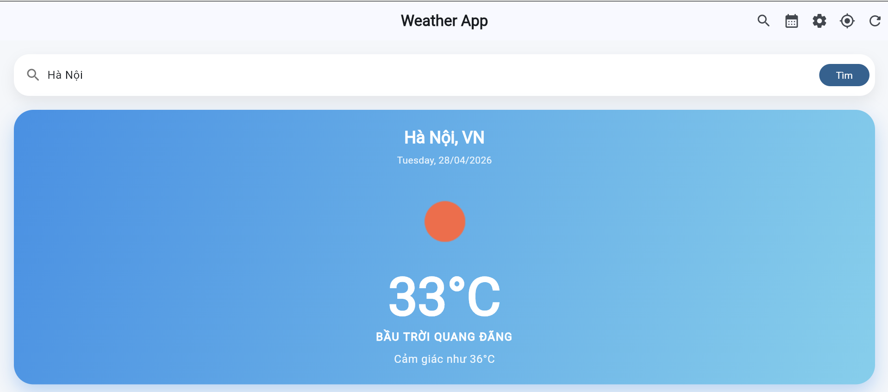
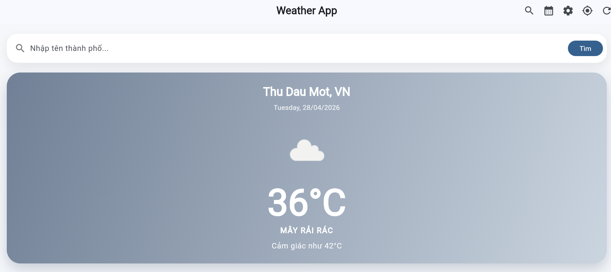
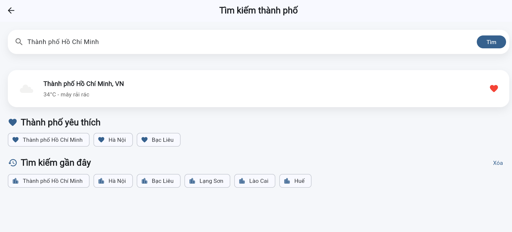
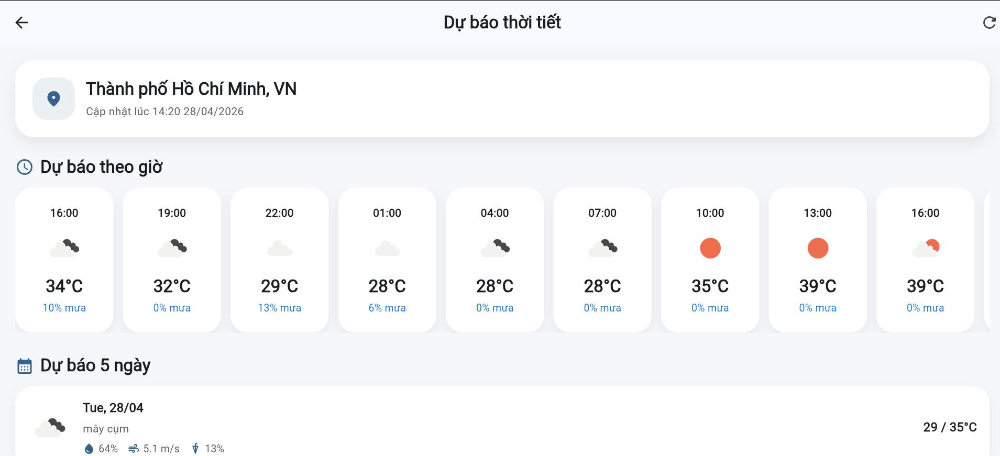
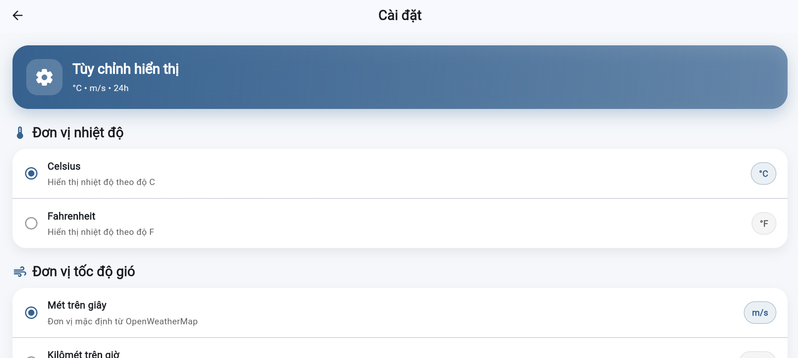
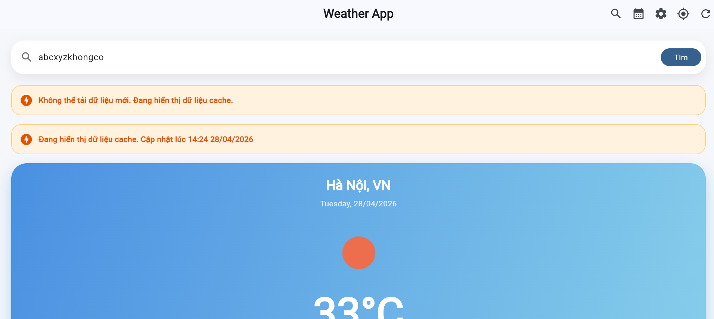
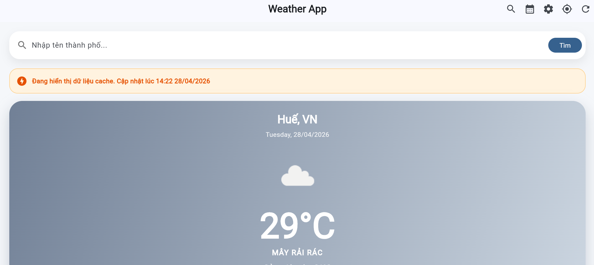

<div align="center">

# 🌦️ Weather App with API Integration

### Ứng dụng thời tiết Flutter sử dụng OpenWeatherMap API


</div>

---

## 📌 Tổng quan

**Weather App** là ứng dụng thời tiết được xây dựng bằng **Flutter**, tích hợp **OpenWeatherMap API** để hiển thị dữ liệu thời tiết theo thời gian thực. Ứng dụng hỗ trợ xem thời tiết hiện tại, dự báo theo giờ, dự báo 5 ngày, tìm kiếm thành phố, lấy thời tiết theo vị trí GPS, lưu thành phố yêu thích, lưu lịch sử tìm kiếm, tùy chỉnh đơn vị hiển thị và sử dụng dữ liệu cache khi thiết bị offline.

### ✨ Tính năng nổi bật

| Nhóm chức năng | Mô tả |
| --- | --- |
| 🌤️ Thời tiết hiện tại | Hiển thị nhiệt độ, mô tả thời tiết, icon, độ ẩm, gió, áp suất, tầm nhìn |
| 🔍 Tìm kiếm thành phố | Tìm thời tiết theo tên thành phố và lưu lịch sử tìm kiếm |
| 📍 GPS Location | Lấy thời tiết theo vị trí hiện tại của người dùng |
| 📅 Forecast | Hiển thị dự báo theo giờ và dự báo 5 ngày |
| ❤️ Favorite Cities | Lưu và quản lý danh sách thành phố yêu thích |
| ⚙️ Settings | Đổi đơn vị nhiệt độ, tốc độ gió, định dạng thời gian |
| 📦 Offline Cache | Hiển thị dữ liệu đã lưu khi thiết bị mất mạng |
| ♿ Accessibility | Bổ sung semantic labels, tooltip và mô tả rõ ràng cho các thành phần chính |

---

## 1. Giới thiệu dự án

Dự án này thuộc **Lab 4 - Weather Application with API Integration**. Mục tiêu chính là xây dựng một ứng dụng thời tiết có khả năng gọi API thực tế, xử lý dữ liệu JSON, quản lý trạng thái bằng Provider, lưu dữ liệu bằng SharedPreferences và hiển thị giao diện responsive trên Flutter.

Ứng dụng cho phép người dùng:

- Xem thời tiết hiện tại theo thành phố.
- Lấy thời tiết theo vị trí GPS hiện tại.
- Tìm kiếm thời tiết bằng tên thành phố.
- Xem dự báo theo giờ.
- Xem dự báo 5 ngày.
- Lưu lịch sử tìm kiếm.
- Lưu thành phố yêu thích.
- Đổi đơn vị nhiệt độ.
- Đổi đơn vị tốc độ gió.
- Đổi định dạng thời gian.
- Hiển thị dữ liệu cache khi mất mạng.
- Xử lý lỗi API, lỗi nhập liệu và lỗi kết nối mạng.
- Hỗ trợ accessibility cơ bản thông qua `Semantics`, `tooltip`, `labelText` và thông báo trạng thái rõ ràng.

---

## 2. Công nghệ sử dụng

| Thành phần | Công nghệ / Thư viện |
| --- | --- |
| Framework | Flutter |
| Ngôn ngữ | Dart |
| API thời tiết | OpenWeatherMap |
| State Management | Provider |
| HTTP Client | http |
| Location | geolocator, geocoding |
| Local Storage | shared_preferences |
| Date Formatting | intl |
| Image Loading | cached_network_image |
| Environment Variables | flutter_dotenv |
| Network Status | connectivity_plus |
| Accessibility | Flutter Semantics, Tooltip, InputDecoration label/hint |

---

## 3. Tính năng chính

### 3.1. Current Weather

Ứng dụng hiển thị các thông tin thời tiết hiện tại:

- Tên thành phố và quốc gia.
- Ngày hiện tại.
- Nhiệt độ.
- Cảm giác như.
- Mô tả thời tiết.
- Icon thời tiết.
- Độ ẩm.
- Tốc độ gió.
- Áp suất.
- Tầm nhìn.
- Mây.
- Nhiệt độ thấp nhất và cao nhất.

### 3.2. Location-based Weather

Ứng dụng hỗ trợ lấy thời tiết theo vị trí hiện tại của người dùng thông qua GPS.

Luồng xử lý:

1. Người dùng bấm nút vị trí hiện tại trên AppBar.
2. App kiểm tra quyền truy cập vị trí.
3. App lấy tọa độ hiện tại bằng `geolocator`.
4. App gọi OpenWeatherMap API theo latitude và longitude.
5. App hiển thị thời tiết của khu vực hiện tại.

### 3.3. Search City

Người dùng có thể nhập tên thành phố để tìm kiếm thời tiết. Ứng dụng xử lý các trường hợp:

- Tên thành phố hợp lệ.
- Ô tìm kiếm rỗng.
- Thành phố không tồn tại.
- Mất kết nối mạng khi tìm kiếm.

### 3.4. Forecast

Ứng dụng hiển thị:

- Dự báo theo giờ.
- Dự báo 5 ngày.
- Nhiệt độ theo từng mốc thời gian.
- Xác suất mưa.
- Độ ẩm.
- Tốc độ gió.
- Nhiệt độ thấp nhất và cao nhất theo ngày.

### 3.5. Favorite Cities và Recent Searches

Ứng dụng hỗ trợ:

- Lưu thành phố yêu thích.
- Xóa thành phố khỏi danh sách yêu thích.
- Lưu lịch sử tìm kiếm.
- Bấm nhanh vào city trong lịch sử để tìm lại.

### 3.6. Settings

Ứng dụng hỗ trợ thay đổi:

- Đơn vị nhiệt độ: Celsius / Fahrenheit.
- Đơn vị tốc độ gió: m/s, km/h, mph.
- Định dạng thời gian: 24h / 12h.
- Ngôn ngữ hiển thị: Vietnamese / English preference.

Các cài đặt được lưu bằng `SharedPreferences`.

### 3.7. Offline Cache

Khi có mạng, app lưu dữ liệu thời tiết gần nhất vào cache. Khi mất mạng, app không bị crash mà hiển thị lại dữ liệu đã lưu.

Ứng dụng hiển thị banner thông báo khi đang dùng dữ liệu cache.

### 3.8. Accessibility Features

Ứng dụng đã bổ sung accessibility cơ bản để cải thiện trải nghiệm sử dụng:

- `Semantics` cho card thời tiết hiện tại.
- `Semantics` cho các item chi tiết thời tiết như độ ẩm, gió, áp suất, tầm nhìn.
- `labelText` và `hintText` rõ ràng cho ô tìm kiếm trên HomeScreen và SearchScreen.
- `Semantics` cho nút thêm/xóa thành phố yêu thích.
- `tooltip` cho các nút chính trên AppBar: Search, Forecast, Settings, GPS Location và Refresh.
- Banner lỗi và banner offline/cache có nội dung rõ ràng, dễ hiểu.

---

## 4. Bonus Features Implemented

| Bonus | Mô tả | Trạng thái |
| --- | --- | --- |
| Accessibility features | Thêm semantic labels, tooltip, accessible search fields và mô tả rõ cho nút favorite | Completed |
| Beautiful weather icons | Sử dụng icon từ OpenWeatherMap và fallback Material Icons theo điều kiện thời tiết | Completed |
| Offline-first support | Dữ liệu thời tiết gần nhất được lưu cache và hiển thị khi mất mạng | Completed |
| Responsive UI | Giao diện có scroll, forecast ngang và layout co giãn trên Chrome Web | Completed |

> Ghi chú: Các bonus lớn như weather maps, home screen widgets, notifications hoặc multiple API fallback được đưa vào mục Future Improvements vì cần cấu hình native Android/iOS hoặc thêm API/package phức tạp hơn.

---

## 5. Cấu trúc thư mục

```text
lib/
  main.dart

  config/
    api_config.dart

  models/
    weather_model.dart
    forecast_model.dart
    location_model.dart
    hourly_weather_model.dart

  services/
    weather_service.dart
    location_service.dart
    storage_service.dart
    connectivity_service.dart

  providers/
    weather_provider.dart
    location_provider.dart

  screens/
    home_screen.dart
    search_screen.dart
    forecast_screen.dart
    settings_screen.dart

  widgets/
    current_weather_card.dart
    daily_forecast_card.dart
    error_widget.dart
    hourly_forecast_list.dart
    loading_shimmer.dart
    weather_detail_item.dart

  utils/
    constants.dart
    date_formatter.dart
    weather_icons.dart
```

---

## 6. Hướng dẫn cài đặt API key

Ứng dụng sử dụng OpenWeatherMap API. Để chạy được app, cần tạo file `.env` trong thư mục gốc project.

### Bước 1: Đăng ký API key

Truy cập OpenWeatherMap và đăng ký tài khoản để lấy API key:

```text
https://openweathermap.org/api
```

### Bước 2: Tạo file `.env`

Tạo file `.env` ngang hàng với `pubspec.yaml`:

```env
OPENWEATHER_API_KEY=your_actual_api_key_here
```

### Bước 3: Tạo file `.env.example`

File `.env.example` dùng để hướng dẫn cấu hình API key, không chứa key thật:

```env
OPENWEATHER_API_KEY=your_api_key_here
```

### Bước 4: Kiểm tra `.gitignore`

Đảm bảo file `.env` không được đẩy lên GitHub:

```gitignore
.env
.env.*
!.env.example
```

---

## 7. Cách chạy project

### Bước 1: Cài dependencies

```bash
flutter pub get
```

### Bước 2: Kiểm tra lỗi

```bash
flutter analyze
```

Kết quả mong đợi:

```text
No issues found!
```

### Bước 3: Chạy app trên Chrome

```bash
flutter run -d chrome
```

### Bước 4: Chạy app trên thiết bị Android

```bash
flutter run
```

---

## 8. Screenshots

### 8.1. Home Screen - Current Weather



### 8.2. Current Location Weather - GPS



### 8.3. Search Screen



### 8.4. Forecast Screen



### 8.5. Settings Screen



### 8.6. Error State



### 8.7. Offline Cache



---

## 9. Testing

Dự án đã được kiểm thử thủ công với các nhóm test chính:

- API Integration Testing.
- GPS Location Testing.
- Search Functionality Testing.
- Forecast Testing.
- Settings Testing.
- Offline Cache Testing.
- UI Responsiveness Testing.
- Loading State Testing.
- Error Handling Testing.
- Accessibility Testing.
- Code Quality Testing.

File kiểm thử chi tiết:

```text
TESTING.md
```

Một số kết quả chính:

| Nhóm kiểm thử | Kết quả |
| --- | --- |
| API Integration | Pass |
| GPS Current Location | Pass |
| Search City | Pass |
| Forecast | Pass |
| Settings | Pass |
| Offline Cache | Pass |
| Accessibility | Pass |
| UI Responsiveness | Pass |
| Error Handling | Pass |
| Flutter Analyze | No issues found |

---

## 10. Accessibility Testing

| STT | Test case | Kết quả mong đợi | Kết quả thực tế | Trạng thái |
| --- | --- | --- | --- | --- |
| 1 | Kiểm tra label cho card thời tiết | Screen reader có thể đọc thông tin thời tiết hiện tại | Đã thêm `Semantics` cho `CurrentWeatherCard` | Pass |
| 2 | Kiểm tra label cho weather details | Mỗi thông tin như độ ẩm, gió, áp suất có label rõ ràng | Đã thêm `Semantics` cho `WeatherDetailItem` | Pass |
| 3 | Kiểm tra ô tìm kiếm HomeScreen | TextField có label và hint rõ ràng | Đã thêm `labelText` và `hintText` | Pass |
| 4 | Kiểm tra ô tìm kiếm SearchScreen | TextField có label và hint rõ ràng | Đã thêm `labelText` và `hintText` | Pass |
| 5 | Kiểm tra nút yêu thích | Nút favorite có mô tả thêm/xóa city yêu thích | Đã thêm `Semantics label` | Pass |
| 6 | Kiểm tra các nút AppBar | Các nút chính có tooltip rõ ràng | Search, Forecast, Settings, GPS, Refresh đều có tooltip | Pass |

---

## 11. Kết quả kiểm thử GPS

Quy trình test GPS:

1. Mở app khi có mạng.
2. Bấm icon vị trí hiện tại trên AppBar.
3. Cho phép trình duyệt hoặc thiết bị truy cập vị trí nếu được yêu cầu.
4. App lấy tọa độ hiện tại.
5. App gọi OpenWeatherMap API theo latitude và longitude.
6. App hiển thị thời tiết theo vị trí hiện tại.

Kết quả:

- App lấy được vị trí hiện tại.
- App hiển thị thời tiết khu vực hiện tại.
- App cập nhật city theo kết quả API trả về.
- App không crash khi gọi chức năng GPS.

---

## 12. Kết quả kiểm thử offline cache

Quy trình test offline cache:

1. Mở app khi có mạng.
2. Tìm kiếm một thành phố, ví dụ `Tokyo`.
3. Mở Chrome DevTools.
4. Vào tab Network.
5. Chọn chế độ Offline.
6. Nhập city mới, ví dụ `Reykjavik`.
7. Bấm Tìm.

Kết quả:

- App không crash.
- App không tải được dữ liệu mới do offline.
- App hiển thị banner thông báo thiết bị đang offline.
- App tiếp tục hiển thị dữ liệu cache gần nhất.
- Khi bật lại mạng và refresh, app tải lại dữ liệu từ API bình thường.

---

## 13. Quyền Android cần thiết

Trong file:

```text
android/app/src/main/AndroidManifest.xml
```

Cần có các quyền:

```xml
<uses-permission android:name="android.permission.INTERNET" />
<uses-permission android:name="android.permission.ACCESS_FINE_LOCATION" />
<uses-permission android:name="android.permission.ACCESS_COARSE_LOCATION" />
```

---

## 14. Các lệnh hữu ích

### Format code

```bash
dart format lib test
```

### Analyze project

```bash
flutter analyze
```

### Run tests

```bash
flutter test
```

### Clean project

```bash
flutter clean
flutter pub get
```

### Run on Chrome

```bash
flutter run -d chrome
```

---

## 15. Known Limitations

Một số giới hạn hiện tại:

- Chế độ night mode phụ thuộc icon và thời gian thực từ OpenWeatherMap.
- Cache hiện tại lưu dữ liệu gần nhất, chưa lưu riêng cache cho từng thành phố.
- Một số city có thể hiển thị tên theo ngôn ngữ hoặc định dạng do API trả về.
- Dự báo 5 ngày được tổng hợp từ endpoint forecast 3-hour interval của OpenWeatherMap.
- Trên Chrome Web, quyền GPS phụ thuộc trình duyệt và cấu hình thiết bị.
- Multi-language hiện mới có setting lưu lựa chọn, chưa dịch toàn bộ nội dung giao diện.

---

## 16. Future Improvements

Các hướng phát triển tiếp theo:

- Lưu cache riêng cho từng thành phố.
- Thêm biểu đồ nhiệt độ theo giờ.
- Thêm weather animation.
- Thêm air quality index.
- Thêm weather alerts.
- Thêm multi-language đầy đủ.
- Thêm weather map.
- Thêm multiple weather API fallback.
- Thêm home screen widget cho Android.
- Viết thêm unit test cho service, provider và storage.
- Tối ưu UI cho mobile nhỏ hơn.

---

## 17. Submission Notes

Khi nộp bài:

### GitHub Repository

Tên repository đề xuất:

```text
flutter_weather_app_le_nguyen_bao_tran
```

Repository cần có:

- Source code Flutter.
- `README.md`.
- `TESTING.md`.
- `.env.example`.
- `screenshots/`.
- `test/`.

Không được commit:

- `.env`
- `build/`
- `.dart_tool/`
- `ios/Pods/`

### ZIP nộp E-learning

Tên file ZIP đề xuất:

```text
WeatherApp_[StudentID]_LeNguyenBaoTran.zip
```

Trước khi zip cần xóa:

```text
build/
.dart_tool/
ios/Pods/
.env
```

Giữ lại:

```text
.env.example
README.md
TESTING.md
screenshots/
test/
```

---

## 18. Tác giả

- **Họ tên:** Lê Nguyễn Bảo Trân
- **Project:** Weather App with API Integration
- **Lab:** Lab 4 - Weather Application with API Integration
