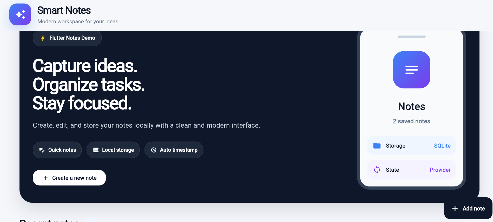
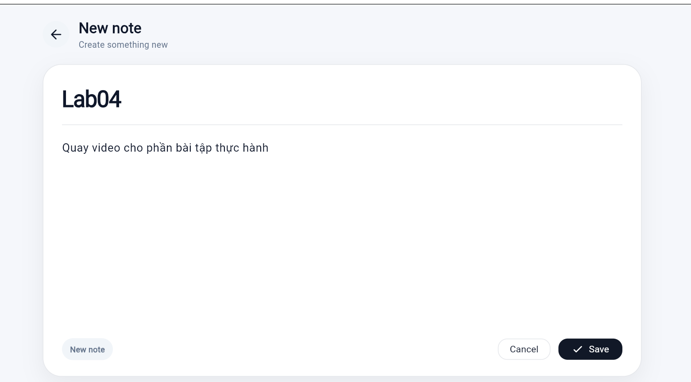
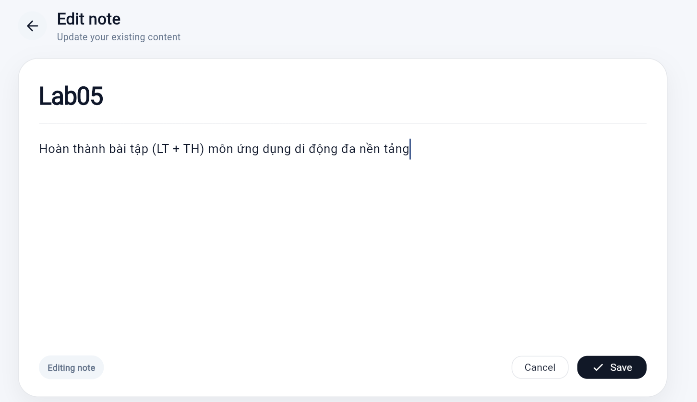
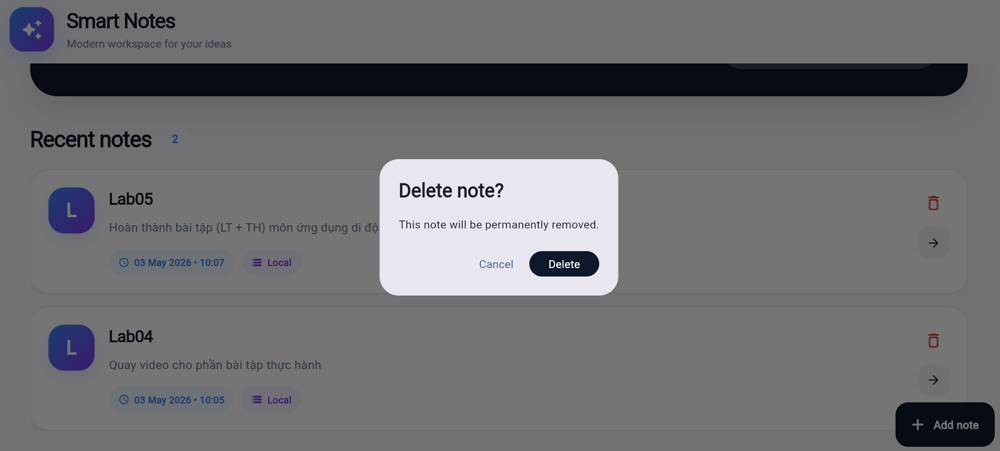
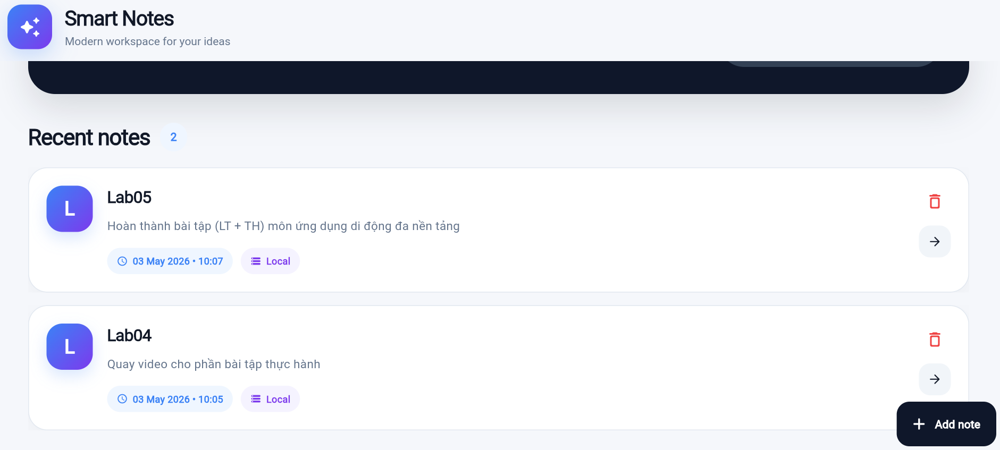

# ✨ Smart Notes - Ứng dụng ghi chú đơn giản

**Smart Notes** là ứng dụng ghi chú được xây dựng bằng **Flutter**. Ứng dụng cho phép người dùng tạo, xem, chỉnh sửa và xóa ghi chú. Dữ liệu được lưu cục bộ bằng SQLite, giúp ghi chú vẫn còn sau khi tắt và mở lại ứng dụng.

---

## 📌 Mục tiêu bài thực hành

Dự án được thực hiện theo yêu cầu bài thực hành **Simple Note App Creation** với các nội dung chính:

- 📝 Tạo ghi chú gồm tiêu đề và nội dung
- 📋 Hiển thị danh sách ghi chú dạng cuộn
- ✏️ Chỉnh sửa ghi chú đã tạo
- 🗑️ Xóa ghi chú có hộp thoại xác nhận
- 💾 Lưu dữ liệu cục bộ bằng SQLite
- ⏰ Theo dõi thời gian tạo và cập nhật ghi chú
- 🔄 Quản lý trạng thái bằng Provider

---
## 📸 Hình ảnh giao diện

### 🏠 Màn hình chính



### ✍️ Thêm ghi chú mới



Người dùng có thể tạo ghi chú mới bằng cách bấm nút **Create a new note** hoặc nút **Add note**.

### ✏️ Chỉnh sửa ghi chú



Khi bấm vào một ghi chú, người dùng được chuyển đến màn hình chỉnh sửa để cập nhật nội dung.

### 🗑️ Xác nhận xóa ghi chú



Người dùng có thể xóa ghi chú. Trước khi xóa, ứng dụng hiển thị hộp thoại xác nhận để tránh xóa nhầm.

### 📋 Danh sách ghi chú



Các ghi chú được hiển thị trong danh sách cuộn tại màn hình chính. Mỗi ghi chú có tiêu đề, nội dung rút gọn và thời gian cập nhật.


## 🛠️ Công nghệ sử dụng

| Công nghệ | Mục đích |
|---|---|
| 🐦 Flutter | Xây dựng giao diện ứng dụng |
| 🎯 Dart | Ngôn ngữ lập trình chính |
| 🗄️ Sqflite | Làm việc với SQLite |
| 🌐 sqflite_common_ffi_web | Hỗ trợ SQLite khi chạy trên Chrome/Web |
| 📦 Provider | Quản lý trạng thái ứng dụng |
| 📅 Intl | Định dạng ngày giờ |
| 🧭 Path | Xử lý đường dẫn database |

---

## 📁 Cấu trúc thư mục

```text
lib/
├── models/
│   └── note.dart
├── database/
│   └── db_helper.dart
├── providers/
│   └── note_provider.dart
├── screens/
│   ├── home_page.dart
│   └── note_editor_screen.dart
├── widgets/
│   └── note_card.dart
└── main.dart
```

---

## 📂 Giải thích các file chính

### 📄 `note.dart`

File model dùng để mô tả đối tượng ghi chú.

Một ghi chú gồm:

- `id`
- `title`
- `content`
- `createdAt`
- `updatedAt`

File này cũng có các hàm chuyển đổi dữ liệu giữa object Dart và Map để lưu vào SQLite.

---

### 🗄️ `db_helper.dart`

File xử lý database SQLite.

Các chức năng chính:

- Tạo database
- Tạo bảng `notes`
- Thêm ghi chú
- Đọc danh sách ghi chú
- Cập nhật ghi chú
- Xóa ghi chú

---

### 🔄 `note_provider.dart`

File quản lý trạng thái của danh sách ghi chú bằng Provider.

Các chức năng chính:

- Load danh sách ghi chú
- Thêm ghi chú mới
- Cập nhật ghi chú
- Xóa ghi chú
- Gọi `notifyListeners()` để cập nhật giao diện

---

### 🏠 `home_page.dart`

Màn hình chính của ứng dụng.

Màn hình này gồm:

- AppBar có tiêu đề ứng dụng
- Khu vực giới thiệu ứng dụng
- Danh sách ghi chú dạng cuộn
- FloatingActionButton để thêm ghi chú mới

---

### ✍️ `note_editor_screen.dart`

Màn hình thêm và chỉnh sửa ghi chú.

Màn hình này dùng chung cho hai trường hợp:

- Thêm ghi chú mới
- Chỉnh sửa ghi chú cũ

---

### 🧩 `note_card.dart`

Widget hiển thị từng ghi chú trong danh sách.

Mỗi note card gồm:

- Chữ cái đại diện
- Tiêu đề ghi chú
- Nội dung ghi chú
- Thời gian cập nhật
- Nút xóa
- Nút mở chi tiết

---

## ▶️ Cách chạy project

### 1. Cài package

```bash
flutter pub get
```

### 2. Chạy trên Chrome

```bash
flutter run -d chrome --web-port 8080
```

### 3. Chạy trên Windows

```bash
flutter run -d windows
```

> 💡 Lưu ý: Nếu chạy trên Windows, máy cần cài **Visual Studio 2022** với workload **Desktop development with C++**.

---

## 🌐 Lưu ý khi chạy trên Web/Chrome

Vì ứng dụng sử dụng SQLite trên Web, project cần package:

```yaml
sqflite_common_ffi_web
```

Sau khi cài package, cần chạy lệnh setup:

```bash
dart run sqflite_common_ffi_web:setup
```

Lệnh này tạo các file hỗ trợ SQLite Web trong thư mục `web/`.

---

## 🎨 Giao diện ứng dụng

Ứng dụng được thiết kế theo phong cách hiện đại:

- 🎨 Nền sáng nhẹ
- 🌌 Hero section màu navy đậm
- 💙 Gradient xanh tím
- 🧊 Card bo góc mềm
- ✨ Icon trang trí hiện đại
- 📱 Giao diện phù hợp cả màn hình lớn và nhỏ

---

## ✅ Kết quả đạt được

Sau khi hoàn thành, ứng dụng có thể:

- ✅ Tạo ghi chú mới
- ✅ Hiển thị danh sách ghi chú
- ✅ Chỉnh sửa ghi chú
- ✅ Xóa ghi chú có xác nhận
- ✅ Lưu dữ liệu cục bộ
- ✅ Tự động cập nhật giao diện khi dữ liệu thay đổi
- ✅ Có giao diện hiện đại, dễ sử dụng

---

## 👨‍💻 Thông tin sinh viên

- **Họ và tên:** Lê Nguyễn Bảo Trân
- **MSSV:** 2224802010476
- **Môn học:** Thực hành Ứng dụng Di động đa nền tảng
- **Bài thực hành:** Lab05 - Simple Note App

---

## 📝 Ghi chú

Dự án được thực hiện nhằm luyện tập các kiến thức cơ bản trong Flutter như:

- Xây dựng giao diện với Widget
- Quản lý state với Provider
- Làm việc với SQLite
- Tổ chức cấu trúc thư mục
- Thực hiện các chức năng CRUD cơ bản

---

## ⭐ Kết luận

**Smart Notes** là một ứng dụng ghi chú đơn giản nhưng đầy đủ chức năng cơ bản. Dự án giúp người học hiểu rõ cách xây dựng một ứng dụng Flutter có lưu trữ dữ liệu cục bộ, quản lý trạng thái và thiết kế giao diện hiện đại.
